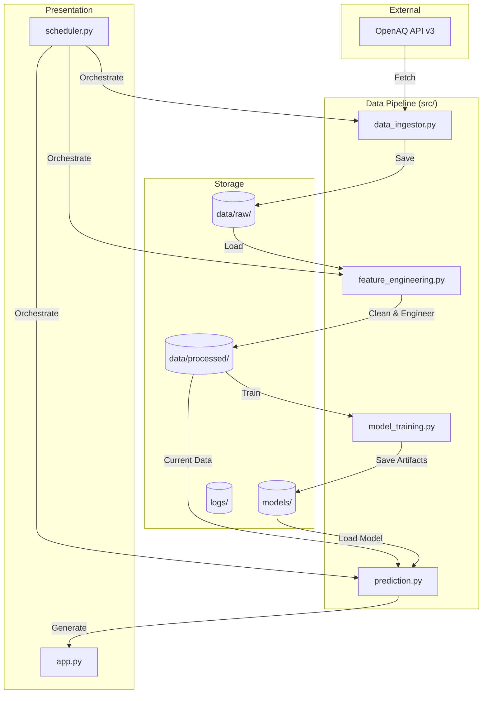

# 🗺️ BreatheSmart Project Map

## Project Overview

BreatheSmart is an automated air quality prediction system for Abu Dhabi. It follows a modular architecture to ingest data, engineer features, train models, and provide real-time forecasts via a dashboard.

## 🏗️ Architecture Diagram

## 📂 Component Breakdown

### Core Logic (`src/`)

- **`config.py`**: Central station for API keys, file paths, and system constants.
- **`data_ingestor.py`**: Robust handler for OpenAQ API communication with retry logic and incremental loading.
- **`feature_engineering.py`**: Transforms raw environmental data into ML features (lags, rolling averages, time features).
- **`model_training.py`**: Trains the XGBoost Regressor and evaluates performance.
- **`prediction.py`**: Operative script to generate the next-hour forecast.
- **`scheduler.py`**: The "heartbeat" that automates the whole pipeline.
- **`visualization.py`**: Utility for generating static plots and reports.
- **`app.py`**: Streamlit-based interactive dashboard.

### Data Storage (`data/`)

- **`raw/`**: Historical archive of API responses (partitioned by pollutant).
- **`processed/`**: The "Single Source of Truth" dataset for training and validation.
- **`predictions.csv`**: Persistent log of all model outputs.

### Assets & Configuration

- **`models/`**: Serialization of trained XGBoost models and feature lists.
- **`logs/`**: System-wide logging for auditing and debugging.
- **`tests/`**: Suite of unit and integration tests.
- **`notebooks/`**: Exploratory Data Analysis and experimental model development.

## 🔄 Data Workflow

1. **Ingest**: Fetch latest readings from OpenAQ.
2. **Process**: Clean outliers and generate time-series features.
3. **Train**: Update model periodically (or use pre-trained).
4. **Predict**: Use latest state to forecast PM2.5 + 1 hour.
5. **Display**: Update Streamlit dashboard with new metrics.
