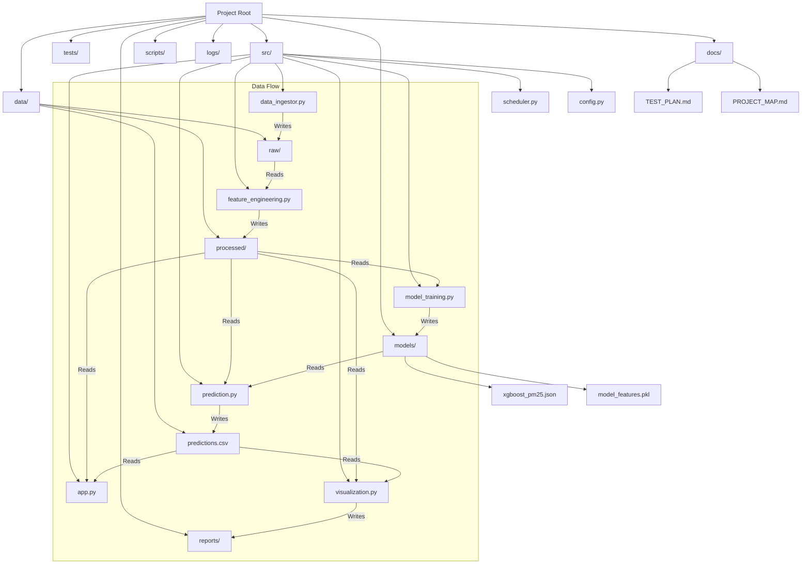

# 🗺️ BreatheSmart Project Map

## Project Structure

## Description of Key Files

### Source Code (`src/`)

- **`data_ingestor.py`**: Fetches air quality data from OpenAQ API.
- **`feature_engineering.py`**: Cleans raw data and creates lag/rolling features for ML.
- **`model_training.py`**: Trains the XGBoost model on processed data.
- **`prediction.py`**: Generates forecasts for the next hour.
- **`scheduler.py`**: Automates the pipeline to run daily or hourly.
- **`config.py`**: Central configuration (API keys, paths, constants).
- **`app.py`**: Streamlit dashboard for real-time monitoring and visualization.
- **`visualization.py`**: Generates static trend charts for reporting.

### Data (`data/`)

- **`raw/`**: Archival storage of fetched JSON/CSV data.
- **`processed/`**: Cleaned, single-file dataset ready for training.
- **`predictions.csv`**: History of all generated forecasts.

### Reports (`reports/`)

- **`pm25_trend_forecast.png`**: Generated visualization of recent trends.
